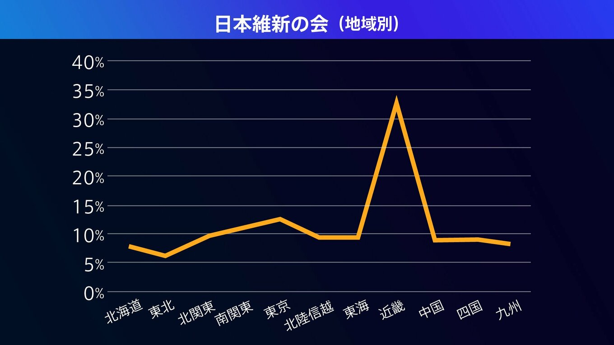

# 2022/07

[TBSの参院選2022、データで見える選挙のリアル](https://newsdig.tbs.co.jp/articles/-/88854?display=1)、という記事で、不適切な種類のグラフを用いたデータ可視化が行われていると考えるため、論評していく。

## figure-01

まず、最初は下記のグラフ。選挙で投票した人のうち、ある政党に投票した人の割合を、地域ごとに示したもの。
当該TBS記事より批評のために引用。[元画像URL](https://newsdig.ismcdn.jp/mwimgs/b/d/1360mw/img_bd9c9706fc043cca9cd752a98b561939371719.jpg)

上記を(数値は不正確だが)、棒グラフで書き直した。また、地図感覚とマッチするように、東側を北海道、西側を九州とした。

